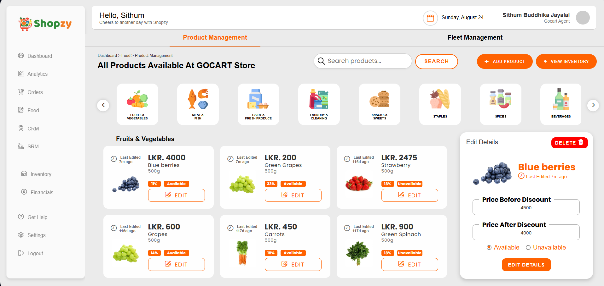
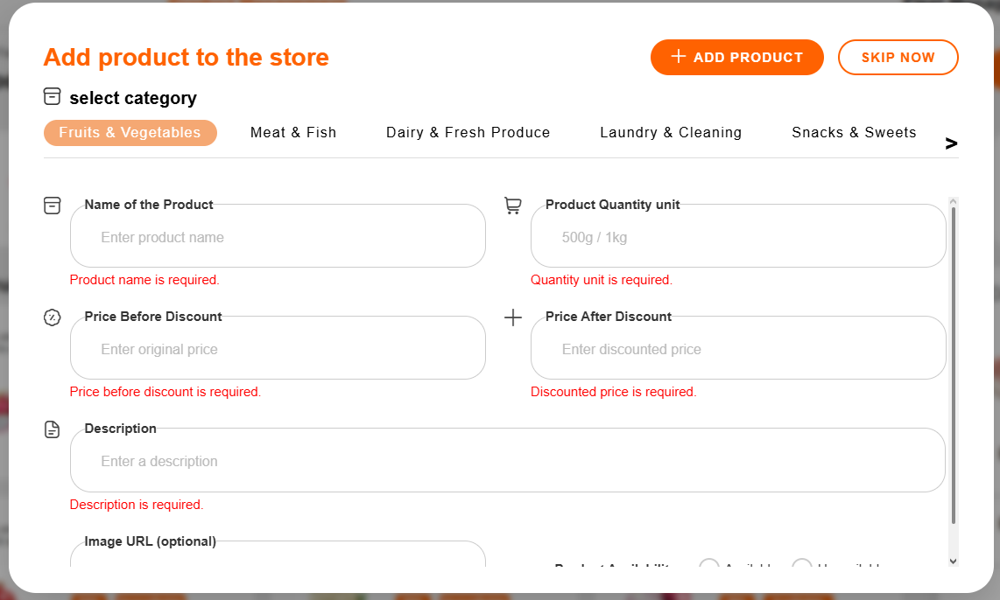
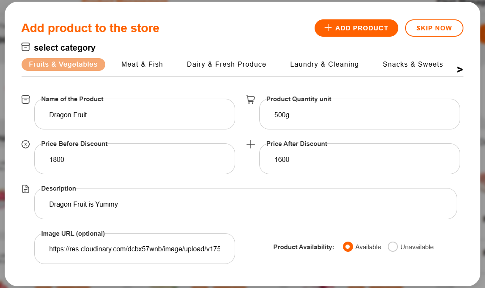
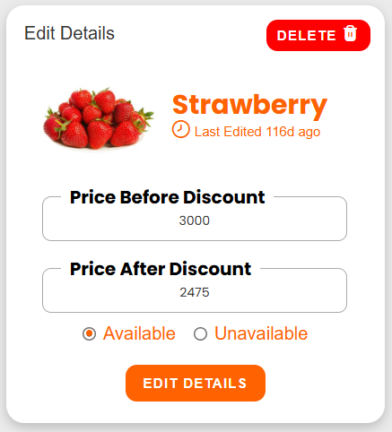
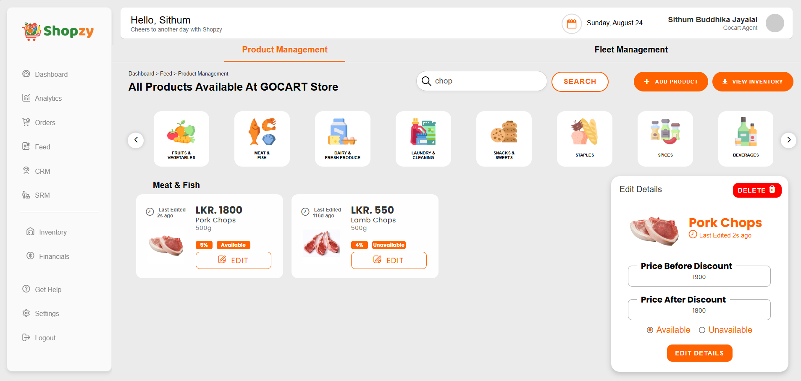
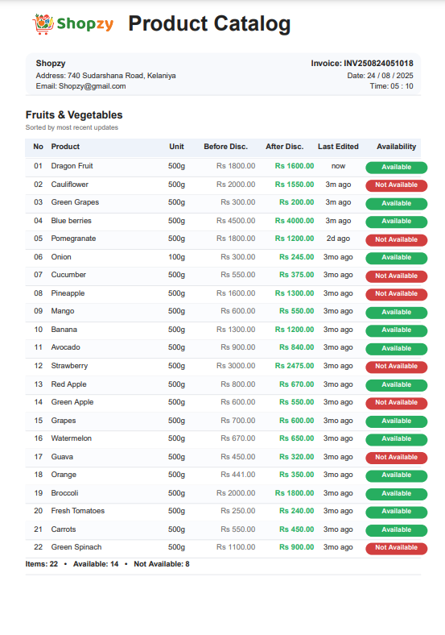

# 🛒 Shopzy – Product Management System  

Shopzy is a **full-stack MERN-based product management system** that helps shop owners efficiently manage inventory, pricing, and availability.  
It includes **real-time search, product categorization, and professional PDF report generation** for easier store management.  

---

## ✨ Features  

### 🔹 Product Category Management  
- Organized categories (Fruits, Meat, Dairy, Beverages, Spices, etc.)  
- Category icons for easy navigation  

### 🔹 Add / Edit / Delete Products  
- Input validation (numeric prices, required fields)  
- Toggle product availability (Available / Unavailable)  
- Price before & after discount handling  

### 🔹 Real-time Search & Filters  
- Search by product name  
- Filter by category and availability  

### 🔹 Price & Inventory Updates  
- Live **“Last Edited”** timestamps  
- Discount tracking  

### 🔹 PDF Report Generation  
- Downloadable product catalog grouped by categories  
- Includes prices, availability, and timestamps  
- Professional header (logo, invoice ID, date, time, shop details)  

---

## 🖼️ Screenshots  

## 🖼️ Screenshots  

### Dashboard – Product Listing  
  

### Add Product Form with Validation  
  
  

### Edit & Delete Product  
  

### Real-time Search Results  
  

### PDF Product Catalog  
  


## 📄 Sample Report  

➡️ [Click here to view the full Product Catalog PDF](./product-catalog.pdf)


➡️ [Click here to view the full Product Catalog PDF](./docs/product-catalog.pdf)

---

## 🛠️ Tech Stack  

- **Frontend**: React.js (Tailwind CSS for UI)  
- **Backend**: Node.js + Express  
- **Database**: MongoDB  
- **Other Tools**:  
  - PDFKit (PDF generation)  
  - Cloudinary (image storage)  

---

## 🚀 Getting Started  

### Install dependencies  

```bash
npm install

````
Run the backend
```bash
cd backend
npm start

````
Run the frontend
```bash
cd frontend
npm start

````
📦 Project Structure
---
Shopzy/
│── backend/          # Node.js + Express server
│   ├── models/       # MongoDB models
│   ├── routes/       # API routes
│   ├── controllers/  # Business logic
│   └── utils/        # Helpers (PDF generator, etc.)
│
│── frontend/         # React app
│   ├── src/components/ 
│   ├── src/pages/ 
│   └── src/assets/ 
│
└── README.md
---

📄 Report Example

---

## 📄 Report Example  

The system generates a **Product Catalog PDF**:  

- Grouped by categories  
- Product name, unit, before/after discount price  
- Availability + last edited timestamp  
- Company header (logo, email, address, invoice ID, date/time)  

*(See `product-catalog.pdf` in repo)*  

---

## 📌 Future Enhancements  

- 🤖 AI-powered pricing recommendations  
- 📊 Predictive analytics for stock alerts  
- 🔍 Natural language search  
- 👥 Multi-user role support  

---

## 🤝 Contributing  

Pull requests are welcome! For major changes, please open an issue first to discuss what you’d like to change.  

---

## 📬 Contact  

📧 Email: **Officialsithumbuddhika@gmail.com**  
🔗 LinkedIn: [www.linkedin.com/in/sithum-buddhika-jayalal-827860341]  


  
